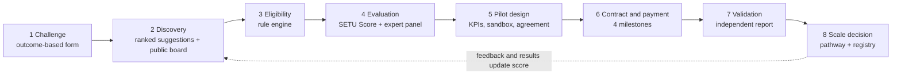
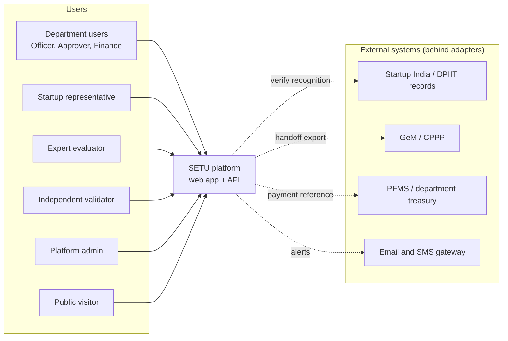
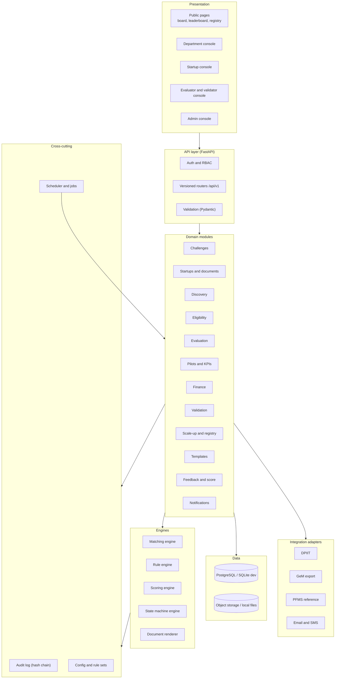
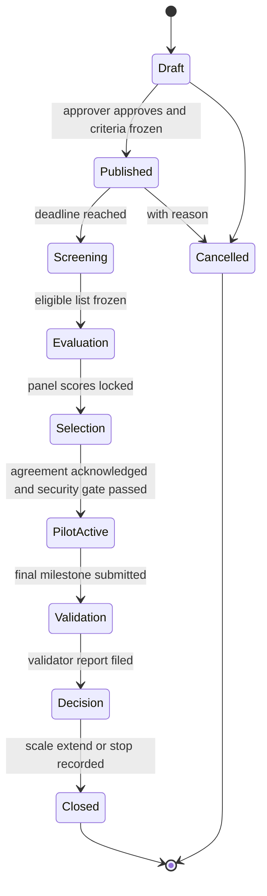
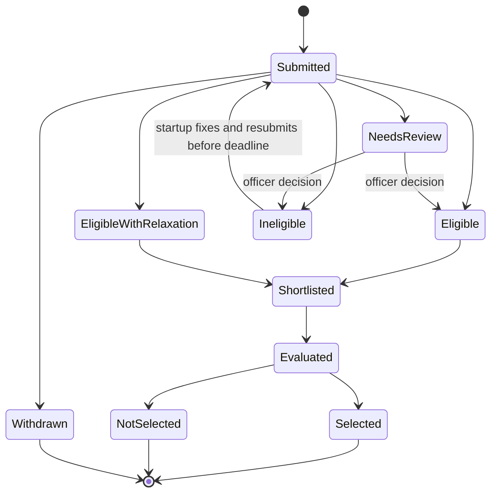
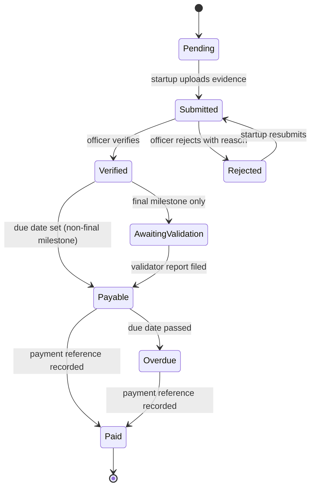
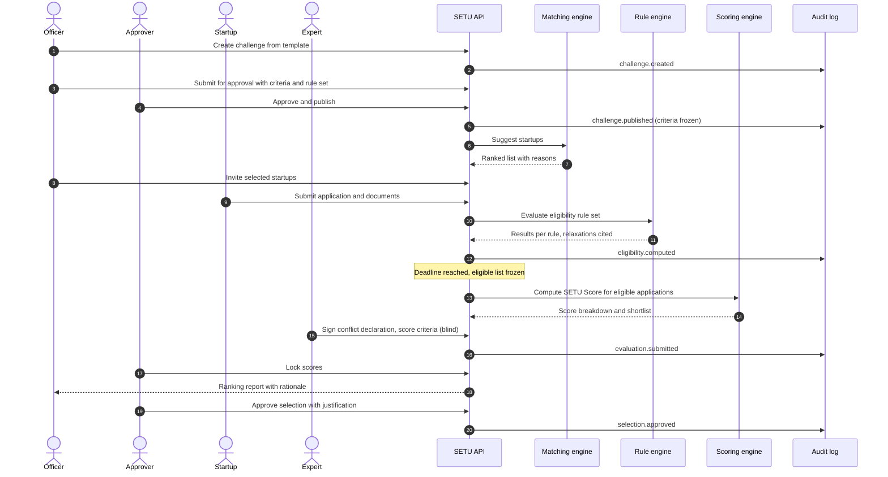
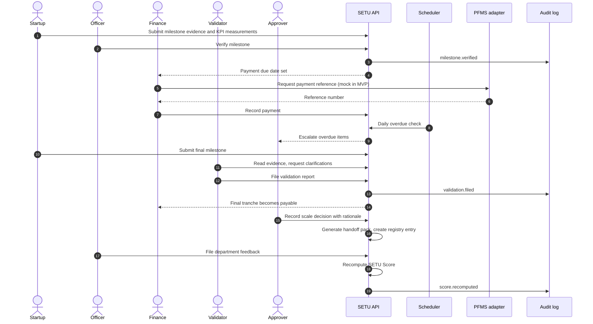
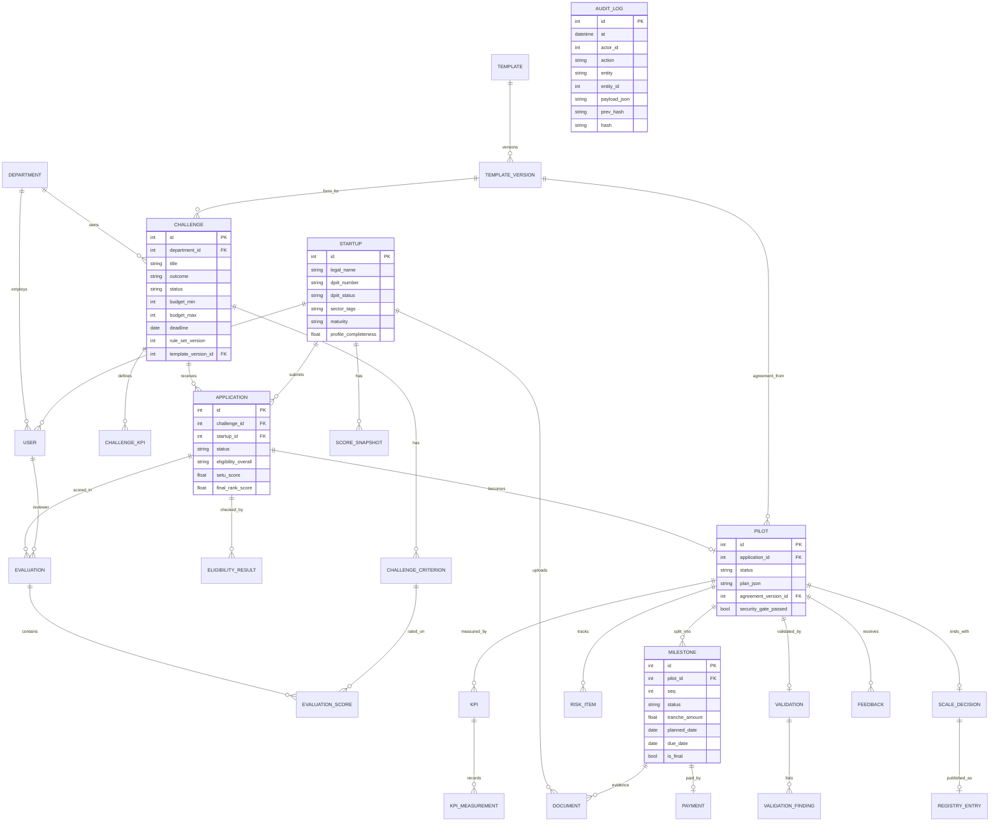
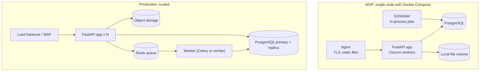

# SETU: Product Requirements and Architecture

**Startup-friendly public procurement mechanism** (Smart India Hackathon 2026, PS 26136)
Team: The prisoners (MITS/SIH26/191) · Version 1.0 draft · 20 September 2026

**Contents**
Part A: Product Requirements (PRD): 1 Purpose · 2 Roles · 3 Scope · 4 Traceability · 5 Workflow · 6 Functional requirements · 7 Business rules · 8 Non-functional requirements · 9 Success metrics · 10 Assumptions, risks, open questions · 11 Release plan
Part B: Architecture: 12 Principles · 13 System context · 14 Logical architecture · 15 Lifecycles · 16 Key sequences · 17 Data model · 18 Rules, scoring and matching design · 19 API design · 20 Security · 21 Integrations · 22 Deployment · 23 Repository layout · 24 Decisions · 25 Testing · 26 Migration from current prototype

---

# PART A: PRODUCT REQUIREMENTS

## 1. Purpose and summary

### 1.1 Problem (from the problem statement)
Government departments face operational problems that startups could solve, but conventional procurement is designed for standardised goods and established vendors. Departments find it hard to write outcome-based problem statements, discover suitable startups, evaluate novel technology, structure controlled pilots, manage IP and data, measure pilot results, and move successful pilots into compliant procurement. Startups face prior-turnover and experience requirements, long sales cycles, unclear payment milestones and little visibility of departmental demand.

### 1.2 Product vision
SETU is a **case-management platform for innovation procurement**. Each government problem becomes one *challenge case* that moves through fixed, gated stages: challenge, discovery, eligibility, expert evaluation, pilot design, milestone contract and payment, independent validation, scale-up decision. Every step is rule-driven, explainable and logged, so the pathway is **transparent, competitive and legally compliant**, which is what the problem statement asks for.

### 1.3 Goals (mapped to the expected outcomes in the problem statement)

| ID | Goal | Expected outcome it serves |
|---|---|---|
| G1 | A department can go from a problem to a ranked, defensible shortlist quickly | Faster discovery and testing of innovative solutions |
| G2 | Pilots follow a standard structure with measurable KPIs and templates | Higher quality pilots |
| G3 | Risk is visible and controlled before and during a pilot (risk band, security gate, risk register) | Reduced departmental risk |
| G4 | Startups are paid against verified milestones with a tracked due date | Timely startup payments |
| G5 | Decisions rest on independently validated evidence | Evidence-based procurement decisions |
| G6 | A validated pilot can be adopted by other departments or districts without starting over | Successful scaling across departments or districts |

### 1.4 Non-goals
- SETU does **not** replace GeM, CPPP or a department's treasury/PFMS process. It prepares, evidences and hands off; the legal purchase and money movement stay in existing systems.
- SETU does **not** give legal advice. Rules and templates are configurable drafts that a procurement or legal officer must approve.
- No AI/LLM makes selection, eligibility or payment decisions. Matching uses text similarity; decisions are made by rules and people.
- No blockchain, no real payment processing, no biometric or Aadhaar-based identity in this version.

### 1.5 Design principles
1. **Outcomes, not specifications.** Departments describe the result they need, not the product to buy.
2. **Every decision is explainable.** Each ranking, eligibility result and payment status shows its reasons.
3. **Rules are data.** Eligibility rules, scoring weights, SLAs and templates are versioned configuration, reviewed by officers, not hardcoded.
4. **Evidence over self-declaration.** Verified documents and completed contracts count more than claims.
5. **Gates, not trust.** A stage cannot be skipped: the system blocks the next step until the gate passes.
6. **Startup-friendly without lowering the quality bar.** Relax turnover and experience requirements; never relax technical capability, security or validation.

## 2. Roles

| Role | Who | Main jobs |
|---|---|---|
| Department Officer | Challenge owner in a department | Drafts and publishes challenges, reviews shortlists, verifies milestones, files feedback |
| Department Approver | Head or nodal authority of the department | Approves publication, pilot selection and scale decision |
| Finance Officer | Department accounts | Sets payment due dates, records payment references |
| Startup Representative | Founder or authorised person | Maintains profile, applies, runs pilot, submits evidence |
| Expert Evaluator | Domain expert (internal or external) | Scores shortlisted startups on the published rubric |
| Independent Validator | Party with no link to the department or startup | Verifies pilot results and issues the validation report |
| Platform Admin | SETU nodal cell | Manages users, rule sets, templates, panels, validators |
| Public Visitor | Anyone, no login | Views the challenge board, leaderboard and registry summaries |

*MVP simplification:* Department Approver and Finance Officer can be permission flags on the Department Officer role.

## 3. Scope by release

| Release | Contents |
|---|---|
| **MVP** (hackathon demo, priority P0) | Roles and access, outcome-based challenge form with public board, startup profile and documents, applications, matching with reasons, eligibility engine with DPIIT relaxations, SETU Score, expert panel evaluation, pilot plan with KPIs, agreement from templates, four-milestone contract with evidence, verification and payment tracking with overdue flags, independent validation, scale-up decision with handoff pack and Validated Solutions Registry, feedback loop, audit log, dashboards, mock integrations |
| **v1.1** (priority P1) | SBERT matching, Q&A and amendments, DPIIT and GeM real integrations where access exists, email/SMS, MFA/SSO, demo-round evaluation, replication workflow, risk register, analytics, DOCX export |
| **Later** (priority P2) | Bulk demand import, multi-language search, digital signature, PFMS integration, cross-district adoption tracker |

## 4. Traceability: problem statement to requirements

| Problem statement text | How SETU answers it | Requirements |
|---|---|---|
| Difficult to formulate outcome-based problem statements | Guided challenge form with baseline, KPI and target; wording check | FR-CH-01, 02 |
| Discover suitable startups | Ranked suggestions with reasons; public board lets startups find demand | FR-DS-01 to 05, FR-CH-04 |
| Evaluate novel technologies | SETU Score plus blind expert panel on a published rubric | FR-EV-01 to 07 |
| Structure controlled pilots | Pilot plan, sandbox and data-access scope, success and exit criteria | FR-PL-01 to 06 |
| Manage intellectual property and data | Data/IP clause options in pilot agreement, data handling gate | FR-TP-04, FR-PL-03, 04 |
| Measure pilot results | KPI baseline, target, measurements, achievement status | FR-KP-01 to 04 |
| Transition to compliant procurement or scale-up | Decision form, pathway recommendation, handoff pack, registry | FR-SC-01 to 06 |
| Startups: prior turnover or experience requirements | Eligibility engine applies DPIIT relaxations (GFR 2017 Rules 170(i), 173(i)) | FR-EL-01 to 06 |
| Startups: long sales cycles | Stage SLA timers, days-in-stage metrics, delay flags | FR-NT-03, FR-AU-03 |
| Startups: unclear payment milestones | Milestones with deliverables, acceptance criteria, tranche and due date | FR-MP-01 to 07 |
| Startups: limited visibility of departmental demand | Public challenge board with filters | FR-CH-04, 05 |
| Transparent, competitive, legally compliant pathway | Published criteria, several applicants, audit log, rule versions, approved templates | FR-CH-03, FR-AU-01 to 06, FR-TP-02 |
| Challenge identification, discovery, screening, evaluation, sandbox/pilot design, milestone contracting, measurement, payment, independent validation, scale-up | The nine stages in section 5 | All modules |
| Standard templates for problem statements, evaluation criteria, pilot agreements, data/IP, cybersecurity, risk management, procurement pathways | Seven versioned templates | FR-TP-01 to 04 |
| May integrate with startup databases and e-marketplaces | Adapter layer with mock and real implementations | FR-IN-01 to 04 |

## 5. End-to-end workflow



### Stage gates

| Stage | Entry condition | Exit gate (must be true to move on) | Owner |
|---|---|---|---|
| 1 Challenge | Officer starts from template | Outcome, at least one KPI with baseline and target, budget, criteria and weights, eligibility rule set, deadline, panel size set; Approver approves | Officer, Approver |
| 2 Discovery | Challenge published | Deadline reached (applications closed) | System |
| 3 Eligibility | Applications closed | Every application has a result; eligible list frozen | System, Officer |
| 4 Evaluation | Eligible list frozen | Panel scores locked, ranking generated | Panel, Admin |
| 5 Pilot design | Selection approved | Plan, KPIs, agreement acknowledged by both parties, security and data checklist done | Officer, Startup |
| 6 Contract and payment | Pilot started | All milestones verified and paid except the final tranche | Startup, Officer, Finance |
| 7 Validation | Final milestone submitted | Validator report filed and locked | Validator |
| 8 Scale decision | Validation report exists | Decision recorded (Scale, Extend, Stop) with rationale | Approver |

Each stage has a configurable target duration; the system shows days-in-stage and flags delays.

## 6. Functional requirements

Priority: **P0** = MVP, **P1** = v1.1, **P2** = later.

### 6.1 Identity and access (ID)

| ID | Requirement | Pri | Acceptance criteria |
|---|---|---|---|
| FR-ID-01 | Startups self-register with email verification, capturing legal name, registration number, DPIIT number, sector tags, location | P0 | Account inactive until email verified; DPIIT number format validated |
| FR-ID-02 | Government users are invited by Admin and bound to one department | P0 | An officer cannot see another department's drafts |
| FR-ID-03 | Role-based access control with the eight roles; deny by default | P0 | Every endpoint lists allowed roles; tests confirm forbidden access returns 403 |
| FR-ID-04 | Short-lived access tokens, refresh rotation, logout revocation, lockout after repeated failures | P0 | Lockout after 5 failed logins for 15 minutes (configurable) |
| FR-ID-05 | MFA for department and Admin roles; SSO adapter | P1 | OTP required at login for those roles |

### 6.2 Challenge management (CH)

| ID | Requirement | Pri | Acceptance criteria |
|---|---|---|---|
| FR-CH-01 | Create a challenge from the problem-statement template: title, context, current baseline, desired outcome, KPIs (metric, baseline, target, unit), budget range, timeline, data classification, geography, sector tags | P0 | Cannot publish without outcome, one KPI with baseline and target, and budget |
| FR-CH-02 | Rule-based wording check flags solution-prescriptive text (brand or model names, "procure N units of") and outcomes with no measurable number | P0 | Officer must fix or override with a reason; override is logged |
| FR-CH-03 | Publishing requires evaluation criteria with weights, eligibility rule set, deadline and panel size; these freeze on publish except through a logged amendment | P0 | Frozen fields are read-only; amendment notifies applicants |
| FR-CH-04 | Public challenge board with search and filters (department, sector, budget band, deadline, status) visible without login | P0 | Sensitive fields (internal notes, data specifics) hidden from the public view |
| FR-CH-05 | Clarification Q&A: startups ask questions, answers are shared with all applicants | P1 | Answer visible to every applicant of that challenge |
| FR-CH-06 | Amendments and cancellation with reason and notification | P1 | Material amendment extends deadline by a configurable minimum |
| FR-CH-07 | Approver sign-off before publication | P0 | Publish button disabled until approved |
| FR-CH-08 | Bulk import of demand pipeline | P2 | CSV upload creates drafts |

### 6.3 Startup registry (ST)

| ID | Requirement | Pri | Acceptance criteria |
|---|---|---|---|
| FR-ST-01 | Profile with description, capabilities, products, technology tags, maturity level, team size, locations, past deployments, demo link | P0 | Profile completeness % shown |
| FR-ST-02 | Document vault (incorporation, DPIIT certificate, declarations, certifications, case studies) with per-document verification status | P0 | Status Unverified, Verified or Rejected, set by Admin or officer with reason |
| FR-ST-03 | "Verified" and "Self-declared" marker on each profile section | P0 | Scoring reads the marker |
| FR-ST-04 | DPIIT verification through adapter with manual fallback | P1 | Result stored with source and timestamp |
| FR-ST-05 | Startup dashboard: applications, pilots, milestone due dates, payments, score breakdown | P0 | All items link to their case |

### 6.4 Discovery and matching (DS)

| ID | Requirement | Pri | Acceptance criteria |
|---|---|---|---|
| FR-DS-01 | For a published challenge, produce ranked startup suggestions with % match and readable reasons | P0 | Each result shows at least one reason (matched terms or tags) |
| FR-DS-02 | Filters on suggestions: sector, DPIIT status, location, risk band, maturity | P0 | Filters combine |
| FR-DS-03 | Officer can invite suggested startups | P0 | Invitation does not add score; all applicants use the same rubric |
| FR-DS-04 | Semantic (SBERT) matching combined with tags | P1 | Beats keyword baseline on a labelled test set (recall at 10) |
| FR-DS-05 | Free-text startup search for officers | P1 | Results explain the match |
| FR-DS-06 | Multi-language query | P2 | Hindi query returns relevant startups |

### 6.5 Eligibility screening (EL)

| ID | Requirement | Pri | Acceptance criteria |
|---|---|---|---|
| FR-EL-01 | On submission, run the challenge's rule set and store a result per rule (Pass, Fail, Relaxed, Manual review) with evidence link | P0 | Overall result is Eligible, Eligible with relaxation, Ineligible or Needs review |
| FR-EL-02 | If a challenge sets minimum turnover, experience or bid security and the startup is DPIIT-verified, mark those rules Relaxed and cite the basis (GFR 2017 Rules 173(i), 170(i)); technical capability evidence stays mandatory | P0 | Relaxed rules show the citation; capability rule cannot be relaxed |
| FR-EL-03 | Startup sees failure reasons and may fix documents and resubmit before the deadline | P0 | Re-run creates a new result version |
| FR-EL-04 | Officer or Admin override with mandatory reason | P0 | Override appears in audit log and on the ranking report |
| FR-EL-05 | Rule sets are versioned; each result records the version used | P1 | Old results remain reproducible |
| FR-EL-06 | Debarment or blacklist flag check | P1 | Flagged startup is Ineligible unless overridden |

### 6.6 Expert evaluation (EV)

| ID | Requirement | Pri | Acceptance criteria |
|---|---|---|---|
| FR-EV-01 | Compute SETU Score (Fit 40, Profile 30, Feedback 30) for eligible applications and shortlist the top N (default 5) | P0 | Breakdown visible; N configurable per challenge |
| FR-EV-02 | Panel of at least 3 reviewers with at least 1 external; reviewer signs a conflict-of-interest declaration per application | P0 | Scoring blocked without declaration; declared conflict removes the reviewer from that application |
| FR-EV-03 | Blind independent scoring against published criteria, with a comment required per criterion | P0 | Other reviewers' scores hidden until lock |
| FR-EV-04 | Aggregate weighted scores, flag large reviewer spread, produce ranking with rationale; lock ranking | P0 | Reopen only by Admin with reason |
| FR-EV-05 | Optional demonstration round with its own scoring | P1 | Demo score combines with rubric by published weight |
| FR-EV-06 | Export ranking explanation as PDF | P1 | Contains scores, reviewers (by ID), overrides |
| FR-EV-07 | Startups receive criterion-level feedback after decision | P1 | Feedback excludes other startups' data |

### 6.7 Pilot design and sandbox (PL)

| ID | Requirement | Pri | Acceptance criteria |
|---|---|---|---|
| FR-PL-01 | Approver selects one to three startups, citing the ranking (parallel pilots create competition) | P0 | Selection justification required |
| FR-PL-02 | Pilot plan: scope, duration, sandbox environment and data access, sites, roles, KPIs, success and exit criteria, budget | P0 | Cannot start with an empty plan |
| FR-PL-03 | Generate pilot agreement from template with data/IP, cybersecurity and risk clauses; both sides acknowledge in the system | P0 | Acknowledgement records user, time, version |
| FR-PL-04 | Security and data gate: pilot cannot start until the security checklist is signed off and a data-handling option is chosen | P0 | Applies when data classification is above public |
| FR-PL-05 | Risk register per pilot with owner and mitigation, reviewed at each milestone | P1 | Milestone verification shows register status |
| FR-PL-06 | Change requests to plan or KPIs need both parties' approval | P1 | Old version retained |

### 6.8 Contracting, milestones and payments (MP)

| ID | Requirement | Pri | Acceptance criteria |
|---|---|---|---|
| FR-MP-01 | Contract with four milestones by default (2 to 6 configurable), each with deliverables, acceptance criteria, required evidence, tranche amount and planned date | P0 | Tranches sum to contract value |
| FR-MP-02 | Startup submits evidence; officer verifies or rejects with reason; rejected milestones can be resubmitted | P0 | Rejection reason visible to startup |
| FR-MP-03 | Verification sets payment due date (verification date plus configured days); payment recorded with a reference number | P0 | Status flows Verified, Payable, Paid |
| FR-MP-04 | Daily overdue detection with dashboard flag and escalation notice | P0 | Overdue count shown per department |
| FR-MP-05 | Final tranche held until a validation report is filed | P0 | Payable blocked until report exists |
| FR-MP-06 | Payment ledger with export; mock PFMS reference adapter | P1 | Export matches ledger |
| FR-MP-07 | Track startup-side delays (late submissions) | P1 | Feeds the risk band |

### 6.9 Performance measurement (KP)

| ID | Requirement | Pri | Acceptance criteria |
|---|---|---|---|
| FR-KP-01 | KPI definition: metric, baseline, target, unit, measurement method, data source, frequency | P0 | All fields mandatory |
| FR-KP-02 | Measurement entries with date, value, source, evidence; officer confirms | P0 | Unconfirmed values are marked |
| FR-KP-03 | Auto-computed achievement % and status (On track, At risk, Off track) with a chart | P0 | Status thresholds configurable |
| FR-KP-04 | Note baseline period or control comparison | P1 | Shown in validator view |

### 6.10 Independent validation (VA)

| ID | Requirement | Pri | Acceptance criteria |
|---|---|---|---|
| FR-VA-01 | Admin assigns a validator who declares no link to the department or startup | P0 | Assignment blocked without declaration |
| FR-VA-02 | Validator can read KPIs, evidence and plan, request clarification, but cannot edit pilot data | P0 | Write endpoints return 403 for this role |
| FR-VA-03 | Report with verdict per KPI (Met, Partly met, Not met), overall recommendation (Scale, Extend, Stop), findings; locked once filed | P0 | PDF generated |
| FR-VA-04 | Startup may comment on findings before the report is final | P1 | Comment attached to report |

### 6.11 Scale-up and registry (SC)

| ID | Requirement | Pri | Acceptance criteria |
|---|---|---|---|
| FR-SC-01 | Decision form (Scale, Extend, Stop) with rationale; if it differs from the validator's recommendation, a justification is mandatory and flagged | P0 | Flag visible in registry and audit |
| FR-SC-02 | Pathway recommendation from rules (for example repeat or extended pilot, GeM Startup Runway route, departmental tender) with a checklist from the procurement pathway template | P0 | Thresholds set by the department, not hardcoded |
| FR-SC-03 | Handoff pack PDF: challenge, evaluation record, KPI results, validation report, feedback, audit extract | P0 | Generated in one click |
| FR-SC-04 | Validated Solutions Registry, published only with department approval | P0 | Public view redacts sensitive details |
| FR-SC-05 | Replication: another department creates a pre-filled challenge that references a registry entry; eligibility and compliance checks still run | P1 | Linked to the original case |
| FR-SC-06 | Adoption tracker across departments and districts | P2 | Counts per solution |

### 6.12 Template library (TP)

| ID | Requirement | Pri | Acceptance criteria |
|---|---|---|---|
| FR-TP-01 | Seven templates as versioned records: problem statement, evaluation criteria, pilot agreement, data and IP clauses, cybersecurity, risk management, procurement pathway | P0 | Each has sections, fields, placeholders |
| FR-TP-02 | Lifecycle Draft, Under review, Approved, Retired; only Approved versions can be used; instances pin the version | P0 | Retiring a version does not alter existing cases |
| FR-TP-03 | Render templates with case data to PDF | P0 | Output shows template name and version |
| FR-TP-04 | Clause alternatives (for example IP retained by startup with licence to department, or joint ownership) chosen at pilot design | P1 | Selected option appears in the agreement |
| FR-TP-05 | DOCX export | P1 | Editable output |

### 6.13 Feedback and score (FB)

| ID | Requirement | Pri | Acceptance criteria |
|---|---|---|---|
| FR-FB-01 | After a pilot, the department rates the startup (delivery, quality, timeliness, support); the startup rates the department process (clarity, payment timeliness) | P0 | Startup's rating of a department does not change the startup's score; it appears on the department dashboard |
| FR-FB-02 | Recompute SETU Score on each feedback or validation event and keep history | P0 | Breakdown and history visible |
| FR-FB-03 | Neutral starting Feedback component for new startups | P0 | No feedback gives the neutral value |
| FR-FB-04 | Startup can dispute a rating; Admin reviews | P1 | Outcome logged |

### 6.14 Audit and reporting (AU)

| ID | Requirement | Pri | Acceptance criteria |
|---|---|---|---|
| FR-AU-01 | Append-only audit log of state changes, overrides, score computations, document access, logins | P0 | No update or delete path exists |
| FR-AU-02 | Hash-chained log entries and a verification endpoint | P0 | Tampering is detected |
| FR-AU-03 | Department dashboard: pipeline by stage, days in stage, overdue items, pending actions | P0 | Reflects live data |
| FR-AU-04 | Public transparency page: leaderboard with score breakdown and risk band, aggregate statistics | P0 | No personal contact data shown |
| FR-AU-05 | Platform analytics for the metrics in section 9 with CSV export | P1 | Definitions match section 9 |
| FR-AU-06 | Per-challenge audit pack export for review or RTI requests | P1 | Includes log extract and documents list |

### 6.15 Notifications and deadlines (NT)

| ID | Requirement | Pri | Acceptance criteria |
|---|---|---|---|
| FR-NT-01 | In-app notifications for assigned tasks and status changes | P0 | Unread count shown |
| FR-NT-02 | Email and SMS through adapters | P1 | Delivery status stored |
| FR-NT-03 | Per-stage target durations with delay flags and days-in-stage metrics | P0 | Config per stage |
| FR-NT-04 | Reminders before deadlines | P1 | Configurable lead time |

### 6.16 Administration (AD)

| ID | Requirement | Pri | Acceptance criteria |
|---|---|---|---|
| FR-AD-01 | Manage departments, users, roles | P0 | Actions logged |
| FR-AD-02 | Manage rule sets, scoring weights, SLA values as versioned configuration with approval | P0 | Changes apply only to new cases |
| FR-AD-03 | Manage sector and technology taxonomy | P1 | Tags used in matching |

### 6.17 Integrations (IN)

| ID | Requirement | Pri | Acceptance criteria |
|---|---|---|---|
| FR-IN-01 | Adapter interfaces with mock implementations for DPIIT lookup, GeM handoff, PFMS reference, notifications, file storage | P0 | Swap by configuration, no code change in modules |
| FR-IN-02 | DPIIT integration or CSV import of recognised startups, depending on access | P1 | Import log kept |
| FR-IN-03 | GeM-compatible export of startup and solution data, format aligned to GeM requirements once confirmed | P1 | Export validates against agreed schema |
| FR-IN-04 | PFMS payment reference integration | P2 | Reference stored on payment |

## 7. Business rules

### 7.1 SETU Score (auto-computed, out of 100)
- **Fit (0 to 40)** = 40 × challenge-to-startup similarity (section 18.1).
- **Profile (0 to 30)** = verified evidence points (section 18.2). Self-declared items earn at most half their points until verified.
- **Feedback (0 to 30)** = past ratings and validated KPI results, blended with a neutral value when there are few pilots (section 18.3).
- The score **shortlists**. The **expert rubric ranks**. Final ranking uses only the published rubric; the SETU Score is shown as supporting evidence.

### 7.2 Risk band
Default thresholds (configurable): score 70 or above is **Low**, 50 to 69 is **Medium**, below 50 is **High**. Any active debarment flag, terminated pilot or unresolved compliance failure forces **High**. The band and its reasons are shown before pilot approval.

### 7.3 Eligibility rules (default rule set, editable per department)

| Rule | Check | Relaxation for DPIIT-verified startup |
|---|---|---|
| E01 | Valid legal registration | None |
| E02 | DPIIT recognition valid (if claimed) | Enables relaxations below |
| E03 | Not debarred, declaration signed | None |
| E04 | Required documents uploaded for this challenge | None |
| E05 | Minimum prior turnover (if the challenge sets one) | Relaxed (GFR 2017 Rule 173(i)) |
| E06 | Minimum prior experience (if set) | Relaxed (GFR 2017 Rule 173(i)) |
| E07 | Earnest money or bid security (if set) | Relaxed (GFR 2017 Rule 170(i)) |
| E08 | Evidence of technical capability (demo, prototype, references) | **Never relaxed** |
| E09 | Application submitted before deadline | None |

Sector-specific conditions on the relaxation (for example manufacturing conditions) are department-configurable and need procurement officer sign-off.

### 7.4 Evaluation rules
- Criteria and weights are published before applications open and cannot change afterward except by logged amendment.
- Panel: at least 3 reviewers, at least 1 external to the department. Reviewers with a declared conflict are excluded for that application.
- Scoring is blind until lock. If the spread between reviewers on any criterion exceeds a threshold (default 30% of the scale), a reconciliation note is required.
- Ranking lock is irreversible except by Admin with a logged reason.

### 7.5 Payment rules
- Tranches are defined in the pilot agreement and sum to the contract value.
- Due date = verification date + N days (proposed default 15, set by department).
- Overdue items escalate to the Approver and appear on the department dashboard.
- Final tranche is held until the validator's report is filed.

### 7.6 Validation and scale rules
- Validator has no declared link to the department or startup and cannot edit pilot data.
- A scale decision that differs from the validator's recommendation needs a written justification that is flagged publicly in the registry entry.
- Registry publication needs department approval; public view removes sensitive data.

## 8. Non-functional requirements

| Area | Requirement |
|---|---|
| Security | HTTPS only; passwords hashed with a modern algorithm (argon2 or bcrypt); input validation on every endpoint; upload type and size limits; rate limiting on login and public endpoints; mitigations for the OWASP Top 10 |
| Privacy | Follow DPDP Act 2023 principles: collect only needed personal data (founder contact details), state purpose, allow correction, define retention; role-based visibility of personal data |
| Auditability | Append-only, hash-chained log; every decision reconstructable from stored data and rule versions |
| Performance | Page response under 2 seconds for common views; shortlist for 5,000 startups under 3 seconds on CPU only; 100 concurrent users on one node |
| Availability | MVP single node with daily backup; production target 99.5% (proposed) with tested restore |
| Accessibility | WCAG 2.1 AA and GIGW-aligned; keyboard navigation; readable contrast |
| Localisation | English first; interface text externalised so Hindi and other languages can be added |
| Hosting | India-hosted; production hosting per department policy (for example NIC or a MeitY-empanelled cloud) |
| Maintainability | Modular code, automated tests on rules and workflows, database migrations, configuration through environment and versioned rule sets |
| Cost | Open-source stack; no paid AI API; no GPU |

## 9. Success metrics

Targets should be agreed with the pilot department after a baseline is measured; the definitions below make them reportable.

| Metric | Definition | Source |
|---|---|---|
| Time to shortlist | Days from challenge published to eligible list frozen, and minutes from applications closed to shortlist generated | Stage timestamps |
| Outcome-based quality | % of challenges published with at least one KPI carrying baseline and target | Challenge data |
| Competition | Average eligible applicants per challenge | Applications |
| Startup inclusion | % of selected startups that were DPIIT-verified and admitted through relaxation | Eligibility results |
| Pilot cycle time | Days from selection to validation report | Stage timestamps |
| Payment timeliness | % of milestone payments made on or before due date; average days overdue | Payments |
| Evidence quality | % of pilots with an independent validation report | Validations |
| Conversion | % of validated pilots that reach a Scale decision | Decisions |
| Replication | Number of departments or districts that adopt a registry solution | Registry |
| Trust | Officer and startup satisfaction ratings after each pilot | Feedback |

## 10. Assumptions, risks and open questions

**Assumptions**
- A pilot department will act as launch partner and provide one real challenge.
- DPIIT recognition can be verified manually or by import until a lookup is confirmed.
- Payments are made through the department's existing process; SETU records status and reference only.
- The department's procurement or legal officer reviews the eligibility rule set and templates before live use.

**Risks**

| Risk | Impact | Mitigation |
|---|---|---|
| Rules misinterpret procurement law | Non-compliant selections | Rules as versioned data; officer approval; citations shown; templates marked draft |
| Officers treat SETU as extra work beside existing systems | Low adoption | Handoff pack, exports, GeM-compatible output, no double data entry where possible |
| Score gaming | Unfair ranking | Verified evidence outweighs self-declaration; expert panel decides ranking |
| Reviewer bias or conflicts | Challenge to fairness | Blind scoring, declarations, spread flags, audit trail |
| Poor data on startups | Weak matching | Profile completeness prompts, verification workflow |
| Keyword matching misses good fits | Missed startups | SBERT upgrade; officers can invite manually |

**Open questions**
1. Which department and state will be the first live user?
2. Who can act as independent validators (for example academic institutions or testing agencies) and how are they empanelled?
3. What are the department's financial powers and thresholds that decide the procurement pathway?
4. Is a DPIIT lookup or data feed available, and on what terms?
5. Which data classifications must be supported for sandbox pilots?
6. Should the public registry show startup names, or only after department approval per entry?

## 11. Release plan

Indicative order of work; no dates are committed.

| Sprint | Focus | Outcome |
|---|---|---|
| 0 | Restructure prototype into modules, Alembic migrations, seed data, CI | Clean base |
| 1 | Roles and access, challenge template and lifecycle, public board, audit log | Departments can publish outcome-based challenges |
| 2 | Startup profile and documents, applications, eligibility engine, matching with reasons | Startups can apply and be screened |
| 3 | SETU Score, expert panel and blind scoring, selection, pilot plan and KPIs, template rendering | Defensible ranking and pilot start |
| 4 | Milestones, evidence, verification, payment tracking, overdue flags, notifications | Milestone-based payments visible |
| 5 | Validation, scale decision, registry, handoff pack, feedback loop | Case closes with evidence |
| 6 | Dashboards, hardening, tests, demo script, documentation | Demo-ready build |

---
# PART B: ARCHITECTURE

## 12. Architecture principles and style

**Style: modular monolith.** One FastAPI application split into domain modules with clear boundaries, one database, one deployable unit. This suits a small team and a demo timeline, and it can be split later because modules only talk through service interfaces.

| Principle | What it means in the code |
|---|---|
| Domain modules own their tables | Only the owning module writes to its tables; other modules call its service functions |
| Rules are data | Eligibility rules, scoring weights, SLAs and templates live in versioned tables and are evaluated by generic engines |
| Adapters at the edges | DPIIT, GeM, PFMS, notification and storage sit behind interfaces with mock and real implementations |
| State machines enforce gates | Every lifecycle has an explicit transition table; illegal transitions are rejected |
| Everything leaves a trace | A single audit service is called by every state change |
| No hidden intelligence | Matching is text similarity with visible reasons; no model makes a decision |

## 13. System context



Solid lines are in the MVP. Dashed lines are adapters: mocks in the MVP, real integrations when access exists.

## 14. Logical architecture



### 14.1 Module responsibilities

| Module | Responsibility | Key tables | Uses |
|---|---|---|---|
| Identity | Users, roles, sessions, invitations | user, department, role_assignment | Audit |
| Challenges | Templates-based challenge, criteria, lifecycle, public board, Q&A | challenge, challenge_criterion, challenge_kpi, qa_item | State machine, Templates, Audit |
| Startups | Profile, documents, verification status | startup, document | Storage, DPIIT adapter |
| Discovery | Suggestions and invitations | invitation, match_result | Matching engine |
| Eligibility | Run rule set, store results, overrides | application, eligibility_result | Rule engine, DPIIT adapter |
| Evaluation | SETU Score, panel, conflict declarations, blind scoring, ranking | evaluation, evaluation_score, panel_member, coi_declaration, ranking | Scoring engine |
| Pilots | Selection, plan, KPIs, agreement, security gate, risk register | pilot, kpi, kpi_measurement, risk_item | Templates, Renderer |
| Finance | Milestones, evidence, verification, payment ledger, overdue | milestone, milestone_evidence, payment | PFMS adapter, Scheduler |
| Validation | Validator assignment, report | validation, validation_finding | Audit |
| Scale-up | Decision, pathway recommendation, handoff pack, registry, replication | scale_decision, registry_entry | Rule engine, GeM adapter, Renderer |
| Templates | Versioned templates, approval, rendering data | template, template_version | Renderer |
| Feedback | Two-way ratings, score history | feedback, score_snapshot | Scoring engine |
| Notifications | In-app and outbound messages | notification | Email/SMS adapter |

## 15. Lifecycles (state machines)

Each state machine is a transition table in code: `(current_state, action, required_role, guard) -> next_state`. Guards are the stage gates from section 5.

### 15.1 Challenge



### 15.2 Application



### 15.3 Milestone and payment



## 16. Key sequences

### 16.1 From challenge to ranked selection



### 16.2 Milestone, payment, validation, scale



## 17. Data model



`AUDIT_LOG` is standalone: it references entities by type and id so it never blocks a delete or migration.

**Conventions**
- Every table has `id`, `created_at`, `updated_at`; status fields use enums matching section 15.
- Rule sets, weights, SLA values and templates are tables with a `version` and `approved_at`.
- Documents are stored as files with metadata (hash, size, type, verification status); the database holds only the path.
- Personal data (founder name, phone, email) sits in the `user` table only, so masking and retention are handled in one place.

## 18. Rules, scoring and matching design

### 18.1 Matching engine (Fit)

```
similarity = 0.75 * text_similarity(challenge_text, startup_text) + 0.25 * tag_overlap(challenge_tags, startup_tags)
Fit        = 40 * similarity
```

- `challenge_text` = outcome + context + KPI names. `startup_text` = capabilities + products + past deployments.
- **v1 (MVP):** TF-IDF cosine similarity (scikit-learn) plus a small sector synonym list. This upgrades the current keyword overlap and still needs no GPU.
- **v1.1:** sentence-transformer embeddings (a small CPU-friendly model, and a multilingual one if Hindi is needed). Embeddings are computed when a profile changes and stored with the startup; cosine similarity runs in memory for a few thousand startups, or with a vector index if the dataset grows.
- **Reasons** are generated from the top overlapping terms and matching tags, so every % match has a visible explanation.
- **Evaluation:** keep a small labelled set of challenge-startup pairs and compare recall at 10 between keyword, TF-IDF and SBERT before switching.

### 18.2 Profile score (0 to 30, default weights)

| Component | Points | Rule |
|---|---|---|
| Verified registration and DPIIT | 6 | Full points only when verified |
| Verified documents and evidence | 8 | Points per verified document type, capped |
| Technical maturity | 8 | Demo, prototype or deployment references, verified by officer or Admin |
| Compliance | 4 | Declarations signed, security self-assessment, no debarment |
| Completed government contracts | 4 | From closed SETU pilots or verified external references |

Self-declared items earn at most 50% of their points until verified. Weights are versioned configuration.

### 18.3 Feedback score (0 to 30)

```
n            = number of completed pilots with feedback
w            = min(n, 3) / 3
quality      = weighted average of department ratings (delivery, quality, timeliness, support)
               and validated KPI achievement, each scaled 0 to 1
Feedback     = 30 * ( w * quality + (1 - w) * 0.5 )
```

A new startup with no history scores the neutral 15, so lack of history does not penalise it. Confidence in real results grows over the first three pilots. Startups' ratings of departments never enter this formula.

### 18.4 Rule engine (eligibility and pathway)

Rules are stored as data and evaluated by a registry of small checker functions keyed by `type`.

```json
{
  "rule_set": "default-v1",
  "rules": [
    {"id": "E02", "type": "registry_check", "source": "dpiit", "sets_flag": "dpiit_verified"},
    {"id": "E05", "type": "min_threshold", "field": "turnover", "param": "challenge.min_turnover",
     "relax_if": "dpiit_verified", "basis": "GFR 2017 Rule 173(i)"},
    {"id": "E07", "type": "requirement", "param": "challenge.bid_security",
     "relax_if": "dpiit_verified", "basis": "GFR 2017 Rule 170(i)"},
    {"id": "E08", "type": "evidence_present", "doc_types": ["demo", "prototype", "reference"], "relaxable": false}
  ]
}
```

Each result row stores rule id, outcome (Pass, Fail, Relaxed, Manual review), the reason text, the basis cited, the evidence link and the rule set version. The pathway recommender uses the same engine with department-defined thresholds (contract value bands, startup status) that map to options such as repeat pilot, GeM Startup Runway route or departmental tender.

### 18.5 Evaluation aggregation

```
reviewer_total = sum( criterion_weight * criterion_score / max_score )
final_score    = mean( reviewer_total across reviewers )
spread flag    = max(reviewer_total) - min(reviewer_total) > threshold (default 0.30)
```

Reviewers see only their own scores until the panel is locked. After lock, the ranking report lists per-criterion averages, spread flags, overrides and the SETU Score alongside.

## 19. API design

Base path `/api/v1`. JSON over HTTPS. Token in the `Authorization` header. Errors return `{code, message, details}`. List endpoints support `page`, `page_size`, `sort` and filters. State-changing calls accept an `Idempotency-Key` header. Every call that changes state writes an audit entry.

| Area | Endpoints | Roles |
|---|---|---|
| Auth | `POST /auth/register-startup` · `POST /auth/login` · `POST /auth/refresh` · `POST /auth/logout` · `GET /me` | Public, then any |
| Admin | `POST /admin/users` · `PUT /admin/rule-sets` · `POST /admin/panels` · `POST /admin/validators` | Admin |
| Challenges | `POST /challenges` · `GET /challenges` (public board) · `GET /challenges/{id}` · `PATCH /challenges/{id}` · `POST /challenges/{id}/submit-for-approval` · `POST /challenges/{id}/publish` · `POST /challenges/{id}/amend` · `POST /challenges/{id}/cancel` | Officer, Approver, Public (read) |
| Discovery | `GET /challenges/{id}/suggestions` · `POST /challenges/{id}/invitations` | Officer |
| Startups | `GET /startups/me` · `PUT /startups/me` · `POST /startups/me/documents` · `POST /documents/{id}/verify` · `GET /startups` (officer view) | Startup, Officer, Admin |
| Applications | `POST /challenges/{id}/applications` · `GET /applications/{id}` · `GET /applications/{id}/eligibility` · `POST /applications/{id}/eligibility/override` · `POST /applications/{id}/withdraw` | Startup, Officer, Admin |
| Evaluation | `GET /challenges/{id}/shortlist` · `GET /evaluations/assigned` · `POST /applications/{id}/coi` · `PUT /applications/{id}/evaluation` · `POST /applications/{id}/evaluation/submit` · `POST /challenges/{id}/evaluations/lock` · `GET /challenges/{id}/ranking` | Officer, Expert, Admin, Approver |
| Selection and pilot | `POST /applications/{id}/select` · `PUT /pilots/{id}/plan` · `POST /pilots/{id}/agreement/generate` · `POST /pilots/{id}/agreement/acknowledge` · `PUT /pilots/{id}/security-checklist` · `POST /pilots/{id}/start` | Approver, Officer, Startup |
| KPIs | `POST /pilots/{id}/kpis` · `POST /kpis/{id}/measurements` · `POST /kpi-measurements/{id}/confirm` | Officer, Startup |
| Milestones | `GET /pilots/{id}/milestones` · `POST /milestones/{id}/submit` · `POST /milestones/{id}/verify` · `POST /milestones/{id}/reject` · `POST /milestones/{id}/payment` | Startup, Officer, Finance |
| Validation | `GET /validations/assigned` · `POST /pilots/{id}/validation/clarifications` · `POST /pilots/{id}/validation/report` | Validator, Admin |
| Scale-up | `POST /pilots/{id}/decision` · `GET /pilots/{id}/handoff-pack` · `GET /registry` · `GET /registry/{id}` · `POST /registry/{id}/replicate` | Approver, Public (read), Officer |
| Feedback | `POST /pilots/{id}/feedback` · `GET /startups/{id}/score` · `GET /leaderboard` | Officer, Startup, Public (read) |
| Templates | `GET /templates` · `POST /templates/{id}/versions` · `POST /template-versions/{id}/submit-review` · `POST /template-versions/{id}/approve` | Admin, Approver |
| Audit and reports | `GET /audit?entity=&id=` · `GET /audit/verify` · `GET /dashboards/department` · `GET /dashboards/platform` · `GET /challenges/{id}/audit-pack` | Officer, Admin |

### 19.1 Access matrix (summary)

| Action | Officer | Approver | Finance | Startup | Expert | Validator | Admin | Public |
|---|---|---|---|---|---|---|---|---|
| Draft challenge | ✓ | ✓ |  |  |  |  | ✓ |  |
| Publish challenge |  | ✓ |  |  |  |  | ✓ |  |
| View public board | ✓ | ✓ | ✓ | ✓ | ✓ | ✓ | ✓ | ✓ |
| Apply |  |  |  | ✓ |  |  |  |  |
| Override eligibility | ✓ |  |  |  |  |  | ✓ |  |
| Score applications |  |  |  |  | ✓ |  |  |  |
| Lock ranking |  | ✓ |  |  |  |  | ✓ |  |
| Verify milestone | ✓ | ✓ |  |  |  |  |  |  |
| Record payment |  |  | ✓ |  |  |  |  |  |
| File validation report |  |  |  |  |  | ✓ |  |  |
| Record scale decision |  | ✓ |  |  |  |  |  |  |
| Approve template version |  | ✓ |  |  |  |  | ✓ |  |
| Read audit log | dept only |  |  |  |  |  | ✓ |  |

Department users can only see records of their own department (row-level scoping in the service layer). Startups see only their own applications and pilots.

## 20. Security architecture

| Concern | Design |
|---|---|
| Authentication | Password hashing (argon2 or bcrypt), email verification, short-lived JWT access token (about 15 minutes), rotating refresh token stored server-side, revocation list, lockout on repeated failures; MFA and SSO adapter in v1.1 |
| Authorization | Role checks in a dependency on every route; department and ownership scoping in services; deny by default |
| Transport and headers | HTTPS only, HSTS, secure headers, CORS limited to known origins |
| Input handling | Pydantic validation; parameterised queries through the ORM; output encoding in the frontend |
| Files | Type and size allow-list, random storage names, stored outside the web root, hash recorded, access through authorised download endpoint, malware scanning in v1.1 |
| Secrets | Environment variables or a secret manager; none in the repository |
| Audit integrity | Each log entry stores `hash = SHA-256(prev_hash + canonical_json(entry))`; `GET /audit/verify` recomputes the chain; database user for the app has insert-only rights on the audit table in production |
| Privacy | Personal data limited to the user table; retention setting; export and correction on request; public views exclude contact data |
| Fairness controls | Blind scoring, conflict declarations, frozen criteria, override reasons, spread flags |
| Availability | Rate limiting on public and auth routes, daily backups, tested restore |

**Threat summary**

| Threat | Example | Control |
|---|---|---|
| Spoofing | Fake startup account | Email verification, document verification, manual review of relaxations |
| Tampering | Edit scores or audit rows | Locked scores, hash chain, insert-only audit role |
| Repudiation | Officer denies an override | Reasoned override logged with actor and time |
| Information disclosure | Startup sees competitors' data; public sees sensitive challenge details | Scoping, redaction on public views, download authorisation |
| Denial of service | Flooding public board | Rate limits, caching of public lists |
| Elevation of privilege | Validator edits pilot data | Role checks, tests for forbidden writes |
| Collusion | Reviewer favours a startup | Independent blind scoring, external reviewer required, declarations, audit |

## 21. Integration adapters

Every adapter has an interface, a mock for demo and tests, and a real implementation added when access exists. Modules depend only on the interface.

| Adapter | Interface (sketch) | MVP mock | Real target |
|---|---|---|---|
| DPIIT | `verify(dpiit_number) -> {valid, name, date, source}` | Looks up a seeded table | Official lookup or bulk data import if provided |
| GeM handoff | `export(startup, solution, results) -> file` | Writes JSON and CSV pack | Format aligned to GeM onboarding requirements once confirmed |
| PFMS | `payment_reference(milestone) -> reference` | Generates a mock reference | Department's existing payment process or PFMS |
| Notifications | `send(channel, to, template, data)` | In-app only, logs to console | SMTP and SMS gateway |
| Storage | `put`, `get`, `delete` | Local disk | S3-compatible object storage |

Adapter calls are logged, time-limited and retried, and failures degrade gracefully: for example, DPIIT lookup failure marks the check as Manual review instead of blocking the application.

## 22. Deployment



- **Environments:** local (SQLite allowed for quick dev), staging, production. Configuration through environment variables.
- **Jobs:** daily overdue check, SLA delay flags, reminders, score recomputation. In-process scheduler in the MVP; a queue worker in production.
- **Observability:** structured logs with request id, health endpoint, error tracking, basic metrics (request rate, error rate, job success).
- **Backups:** daily database dump and file sync, restore rehearsed before go-live.
- **Hosting:** India-hosted per department policy.

## 23. Repository layout

```
setu/
  backend/
    app/
      main.py
      core/            config, security, deps, errors, audit, state_machine
      modules/
        identity/  challenges/  startups/  discovery/  eligibility/
        evaluation/  pilots/  finance/  validation/  scaleup/
        templates/  feedback/  notifications/  reports/
          (each has: models.py schemas.py service.py router.py rules.py)
      engines/
        matching/  scoring/  rules/  rendering/
      integrations/
        base.py  dpiit/  gem/  pfms/  notify/  storage/   (mock.py and real.py in each)
      workers/         scheduler.py, jobs.py
    alembic/           database migrations
    tests/             unit, workflow, api, security
  frontend/
    pages/  (public, department, startup, evaluator, admin)
    js/  css/  components/
  seed/                demo departments, startups, challenges, scores
  docs/                PRD, architecture, API reference, demo script
  docker-compose.yml
  Makefile
```

## 24. Technology stack and decisions

| Layer | Choice | Why |
|---|---|---|
| Backend | Python, FastAPI, Pydantic | Already used; fast to build; typed schemas double as API docs |
| ORM and migrations | SQLAlchemy, Alembic | Already used; migrations needed as tables grow |
| Database | PostgreSQL (SQLite for local dev) | Transactions, constraints, JSON columns, future vector search |
| Matching | scikit-learn TF-IDF, then sentence-transformers | CPU only, explainable, no paid API |
| Documents | Jinja2 templates, WeasyPrint or ReportLab for PDF, python-docx later | Fill the seven templates and reports |
| Jobs | APScheduler, then Celery with Redis | Simple first, scalable later |
| Frontend | Existing HTML, CSS, JavaScript with a small component structure | Keeps the working prototype; a framework can come later |
| Auth | JWT with refresh rotation, passlib with argon2 or bcrypt | Standard and simple |
| Tests | pytest, httpx test client, Playwright for the demo path | Covers rules, workflows and end-to-end |
| Delivery | Docker Compose, GitHub Actions | Repeatable setup and CI |

**Decision records**

| Decision | Chosen | Alternative | Reason |
|---|---|---|---|
| Application style | Modular monolith | Microservices | Small team, one deployable, easy to demo |
| Rules and weights | Versioned data | Hardcoded | Legal and policy changes without redeploy; reproducible old decisions |
| Who ranks | Expert rubric; score only shortlists | Fully automatic ranking | Automated text scores are not enough for novel technology |
| Selection intelligence | No LLM in decisions | LLM scoring | Explainability, auditability and cost |
| Integrations | Adapters with mocks | Direct calls | Access to real systems is uncertain; demo must work |
| Audit | Hash-chained append-only log | Plain log table | Tamper evidence for transparency |
| Competition | Up to three parallel pilots | Single vendor | Keeps the process competitive |
| Public data | Redacted public views | Full public data | Protect sensitive department and startup data |

## 25. Testing strategy

| Level | What is tested |
|---|---|
| Unit | Scoring formulas, risk bands, eligibility rules including relaxations, evaluation aggregation, hash chain |
| Workflow | Every allowed and forbidden transition in the three state machines; gates such as security checklist, final tranche hold, conflict declaration |
| API | Role access for every endpoint; validation errors; department scoping; idempotency |
| Security | Forbidden writes by validator, cross-department access, upload abuse, token expiry, audit tamper detection |
| Matching | Labelled challenge-startup set; recall at 10 for keyword, TF-IDF, SBERT |
| End to end | Scripted demo: challenge, applications, eligibility, panel, pilot, milestones, payment, validation, scale, feedback |
| Data | Seed generator with departments, startups (some DPIIT-verified), challenges, past pilots |

**Acceptance for the demo path:** one scripted run completes all eight stages with the audit log verifying clean, a relaxation cited in an eligibility result, a blocked final tranche until validation, an overdue payment flagged, and a registry entry that another department can replicate.

## 26. Migration from the current prototype

| Existing part | Change |
|---|---|
| Startup registration and profile | Add documents, verification status, verified vs self-declared markers |
| Government Desk (problem posting) | Becomes the Challenges module with the outcome-based template, criteria, approval and lifecycle |
| Keyword matching with % and reason | Moves into the matching engine; add TF-IDF, later SBERT; keep reasons |
| Scoring 40/30/30 and risk band | Moves into the scoring engine; add evidence weighting, cold-start formula, versioned weights |
| Leaderboard | Kept as the public transparency page with breakdown and risk band |
| Four-milestone contract and tranche release | Becomes Pilots and Finance: evidence, verification, due date, overdue, final-tranche hold |
| Feedback and score recompute | Becomes two-way feedback tied to validation; score history kept |
| Role-based access (Government and Startup) | Extend to eight roles with department scoping |
| SQLite and SQLAlchemy | Add Alembic; move to PostgreSQL for staging and production |

**New modules to build:** eligibility engine, expert evaluation, pilot plan and KPIs, template library and renderer, independent validation, scale-up and registry, audit log, notifications and SLA timers, adapters.

---
*Templates and eligibility rule sets in this document are drafts for review by a procurement or legal officer. GFR 2017 Rules 170(i) and 173(i) are cited as published on the Startup India public procurement page; confirm current wording before use.*
